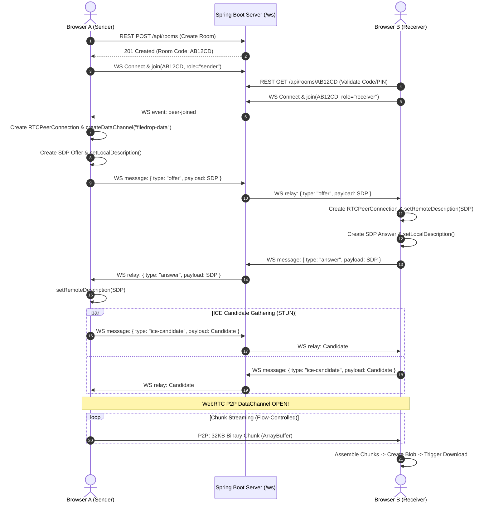

# FileDrop – Secure Peer-to-Peer File Transfer Web Application

[](https://spring.io/projects/spring-boot)
[](https://www.oracle.com/java/)
[](https://webrtc.org/)
[](https://www.mysql.com/)
[]()
[]()

> **FileDrop** is a production-grade, secure, browser-to-browser Peer-to-Peer (P2P) file transfer application built with **Spring Boot** and **WebRTC DataChannel**.
>
> 🔒 **Zero Server File Storage**: The server coordinates room creation and WebRTC signaling (SDP offer/answer and ICE candidate exchange) over WebSockets. The actual file data is transferred **directly between browsers** without ever touching or storing on the backend server.

---

## 🌟 Key Highlights & Features

- ⚡ **True WebRTC RTCDataChannel Streaming**: Direct peer-to-peer transport with zero intermediary cloud proxies.
- 📦 **64KB Chunking & Backpressure Flow Control**: Streams gigabyte-sized files without browser memory exhaustion using `File.slice()`, `dataChannel.bufferedAmount`, and `bufferedamountlow` event backpressure.
- 🗂️ **Batch & Multiple File Support**: Transfer multiple files sequentially with individual file progress and overall batch progress indicators.
- 📱 **QR Code Mobile Pairing**: Instant camera scan pairing with dynamic client-side QR code rendering.
- 🔑 **6-Character Room Codes & Optional PINs**: Lightweight alphanumeric room codes (`AB12CD`) with SHA-256 protected room PINs.
- ⏱️ **Real-Time Telemetry**: Live transfer speed gauge (MB/s), estimated time remaining (ETA), chunk counters, and activity audit timeline.
- 🛡️ **End-to-End Encrypted Transport**: WebRTC DataChannels are inherently encrypted using standard **DTLS** (Datagram Transport Layer Security) and **SCTP**.
- 🎵 **Web Audio Synthesizer Cues**: Non-intrusive sound effects for peer connection, file completion, and error notifications.
- 💾 **Spring Boot Layered Architecture**: Clean separation between Controllers, Services, Repositories, Entities, DTOs, and WebSocket Signaling Handlers with MySQL JPA persistence and automatic H2 fallback.

---

## 📐 Architecture & Signaling Flow

### 1. High-Level Architecture

```mermaid
graph TD
    subgraph Browser_A [Browser A - Sender]
        UA_UI[Modern UI & Dropzone]
        UA_Engine[FileTransferEngine]
        UA_RTC[RTCPeerConnection & DataChannel]
        UA_WS[Signaling Client]
    end

    subgraph SpringBoot_Server [Spring Boot Server]
        REST[REST API /api/rooms]
        WS_Handler[SignalingWebSocketHandler /ws]
        Room_Service[RoomService & Cleanup]
        DB[(MySQL Database)]
    end

    subgraph Browser_B [Browser B - Receiver]
        UB_UI[Dashboard & QR Scanner]
        UB_Engine[FileAssembler & Blob Generator]
        UB_RTC[RTCPeerConnection & DataChannel]
        UB_WS[Signaling Client]
    end

    %% Signaling flow
    UA_UI -->|POST /api/rooms| REST
    REST --> Room_Service --> DB
    UA_WS <-->|WebSocket Signaling: Offer / ICE| WS_Handler
    WS_Handler <-->|WebSocket Signaling: Answer / ICE| UB_WS

    %% Direct P2P DataChannel flow
    UA_Engine --> UA_RTC
    UA_RTC <===>|Encrypted WebRTC RTCDataChannel<br/>Direct P2P Binary Stream (32-64KB Chunks)| UB_RTC
    UB_RTC --> UB_Engine --> UB_UI
```

---

### 2. WebRTC Handshake & Signaling Sequence



---

## 🛠️ Technology Stack

| Component | Technology | Description |
| :--- | :--- | :--- |
| **Frontend** | HTML5, CSS3, Vanilla JS | Cyber-minimalist dark glassmorphism UI |
| **P2P Transport** | WebRTC `RTCDataChannel` | Direct peer-to-peer binary streaming |
| **STUN Traversal** | Google Public STUN (`stun.l.google.com:19302`) | NAT discovery & ICE candidate gathering |
| **Backend** | Java 17+ / Spring Boot 3.3.3 | REST APIs & low-latency WebSocket signaling |
| **Signaling** | Spring WebSocket (`/ws`) | Thread-safe SDP & ICE routing |
| **Database** | MySQL / Spring Data JPA | Audit session metadata & room lifecycle |
| **Dev Fallback** | H2 In-Memory Database | Instant zero-config local development |
| **QR Engine** | Client-side Canvas QR | Offline-ready QR code generation |

---

## 🚀 Getting Started & Installation

### 1. Prerequisites

- **Java JDK**: 17 or higher (JDK 17, 21, or 22)
- **Apache Maven**: 3.8+
- **MySQL Server** (Optional for production; H2 runs out-of-the-box for local testing)

---

### 2. Clone and Setup Environment

```bash
git clone https://github.com/your-username/filedrop.git
cd filedrop
```

Create `.env` or set environment variables (Optional):

```env
PORT=8080
# DB_URL=jdbc:mysql://localhost:3306/filedrop?createDatabaseIfNotExist=true
# DB_USERNAME=root
# DB_PASSWORD=your_password
```

---

### 3. MySQL Database Setup (Optional)

If running with a local MySQL instance:

```sql
CREATE DATABASE IF NOT EXISTS filedrop DEFAULT CHARACTER SET utf8mb4 COLLATE utf8mb4_unicode_ci;
```

Execute `src/main/resources/schema.sql` to initialize tables:

```sql
USE filedrop;

CREATE TABLE IF NOT EXISTS rooms (
    id BIGINT AUTO_INCREMENT PRIMARY KEY,
    room_code VARCHAR(16) NOT NULL UNIQUE,
    pin_hash VARCHAR(255) DEFAULT NULL,
    status VARCHAR(32) NOT NULL DEFAULT 'WAITING',
    sender_session_id VARCHAR(128) DEFAULT NULL,
    receiver_session_id VARCHAR(128) DEFAULT NULL,
    created_at TIMESTAMP DEFAULT CURRENT_TIMESTAMP,
    updated_at TIMESTAMP DEFAULT CURRENT_TIMESTAMP ON UPDATE CURRENT_TIMESTAMP,
    expires_at TIMESTAMP NOT NULL,
    INDEX idx_rooms_code (room_code),
    INDEX idx_rooms_status (status)
);
```

---

### 4. Build and Run

#### Compile and Run:
```bash
mvn spring-boot:run
```

#### Package into Standalone Executable JAR:
```bash
mvn clean package -DskipTests
java -jar target/filedrop-1.0.0.jar
```

Open your browser and navigate to: **`http://localhost:8080`**

---

## 🧪 Testing File Transfers

### Testing in Two Browser Windows on the Same PC:

1. **Window 1 (Sender)**:
   - Open `http://localhost:8080`.
   - Click **Create Transfer**.
   - Note the generated 6-character room code (e.g. `XY92ZK`).
   - Drag and drop or select one or multiple files of any type/size.

2. **Window 2 (Receiver)**:
   - Open `http://localhost:8080` in an **Incognito Window** or another browser (Chrome / Edge / Firefox).
   - Click **Join Transfer** and enter the code `XY92ZK` (or visit `http://localhost:8080/?room=XY92ZK`).
   - Click **Connect & Receive**.

3. **Verify Transfer**:
   - Both windows transition to the **Transfer Dashboard**.
   - Real-time speedometer shows transfer rate (MB/s), ETA countdown, and chunk progress.
   - Upon completion, the receiver sees the **Download** button to save the file.

---

### Testing Across Two Devices on the Same Local Wi-Fi Network:

1. Find your computer's local IP address (e.g. `192.168.1.15`).
2. Run Spring Boot on your computer.
3. Open `http://192.168.1.15:8080` on your PC and click **Create Transfer**.
4. On your mobile phone (connected to the same Wi-Fi), open the camera and **scan the QR code** on the PC screen.
5. Watch files stream directly over WebRTC LAN DataChannel at full Wi-Fi bandwidth!

---

## 📡 REST API Reference

| Method | Endpoint | Description | Request Body | Response |
| :--- | :--- | :--- | :--- | :--- |
| `POST` | `/api/rooms` | Creates a new transfer room | `{"pin": "optional", "totalFiles": 2}` | `RoomResponse` |
| `GET` | `/api/rooms/{code}` | Validates room code & retrieves status | Query: `?pin=...` | `RoomResponse` |
| `POST` | `/api/transfers/complete`| Records completed transfer audit | `{"roomCode": "...", "status": "COMPLETED"}` | `{"status": "SUCCESS"}` |
| `GET` | `/api/stats` | Global transfer metrics | None | `StatsResponse` |
| `GET` | `/api/health` | Service health status | None | `{"status": "UP"}` |

---

## 🔒 Security & Privacy Considerations

1. **Zero-Knowledge Architecture**: The Spring Boot backend only routes ephemeral JSON signaling payloads. It is physically impossible for the server to log or inspect files because files are sliced and sent directly peer-to-peer.
2. **WebRTC DTLS/SRTP Encryption**: WebRTC mandates end-to-end encryption using Datagram Transport Layer Security (DTLS).
3. **Room Capacity Enforcement**: Transfer rooms are strictly limited to **2 peers** (1 Sender, 1 Receiver). Excess join attempts are rejected with `RoomFullException`.
4. **Room Expiration**: Inactive rooms automatically expire after 60 minutes via the Spring `@Scheduled` `CleanupScheduler`.

---

---

## 🚀 Cloud Deployment Guide (GitHub → Render)

Follow these steps to deploy FileDrop to **Render** as a cloud Web Service directly from **GitHub**.

### 1. Create a GitHub Repository
1. Log in to [GitHub](https://github.com/) and click **New Repository**.
2. Name the repository (e.g. `filedrop-p2p`).
3. Set visibility to **Public** or **Private**.
4. Do **not** initialize with a README or .gitignore (they already exist in this project).
5. Click **Create repository**.

### 2. Push Existing Project to GitHub
Open a terminal in your project directory (`p2p/`) and run:
```bash
# Initialize git if not already initialized
git init

# Add all files (respecting .gitignore)
git add .

# Commit changes
git commit -m "feat: prepare FileDrop for Render cloud deployment"

# Rename branch to main
git branch -M main

# Add your GitHub remote URL (replace with your actual GitHub username/repo)
git remote add origin https://github.com/<YOUR_GITHUB_USERNAME>/filedrop-p2p.git

# Push code to GitHub
git push -u origin main
```

---

### 3. Deploy to Render

#### Option A: Deploy via Docker Web Service (Recommended)
1. Log into your [Render Dashboard](https://dashboard.render.com/).
2. Click **New +** → **Web Service**.
3. Select **Build and deploy from a Git repository** and click **Next**.
4. Connect your GitHub account and select your `filedrop-p2p` repository.
5. Configure the service settings:
   - **Name**: `filedrop` (or any preferred name)
   - **Region**: Select closest region (e.g., `Oregon (US West)` or `Frankfurt (EU Central)`)
   - **Branch**: `main`
   - **Runtime**: `Docker` (Render will automatically detect the root `Dockerfile`)
   - **Instance Type**: `Free`
6. Expand **Advanced** and set **Health Check Path** to:
   ```
   /api/health
   ```
7. Click **Create Web Service**.

#### Option B: Deploy via Render Blueprint (`render.yaml`)
1. In Render Dashboard, click **New +** → **Blueprint**.
2. Connect your `filedrop-p2p` repository.
3. Render will read `render.yaml` and configure the Web Service with health check `/api/health` and port settings automatically.
4. Click **Apply**.

---

### 4. Environment Variables on Render

FileDrop runs out-of-the-box using embedded H2 database with zero external configuration. If you wish to customize runtime or connect to an external MySQL database, configure these variables in the **Environment** tab on Render:

| Variable | Required | Default / Example Value | Description |
| :--- | :--- | :--- | :--- |
| `PORT` | Auto by Render | `8080` (or injected by Render) | Listening port for the application |
| `SPRING_PROFILES_ACTIVE` | No | `prod` | Activates production optimizations |
| `CORS_ALLOWED_ORIGINS` | No | `*` | Allowed CORS origins (e.g. `https://filedrop.onrender.com`) |
| `DB_URL` | No | `jdbc:h2:mem:filedrop` | External MySQL JDBC connection URL |
| `DB_USERNAME` | No | `sa` | External database username |
| `DB_PASSWORD` | No | (empty) | External database password |

> [!NOTE]
> Render automatically assigns a random `PORT` environment variable to your container. The Spring Boot application and Dockerfile dynamically bind to `${PORT}` without any manual port configuration required.

---

### 5. Accessing Your Deployed App & Secure WebSockets (`wss://`)

Once Render completes the build and the health check returns `200 OK`, your app will be live at:
```
https://<your-service-name>.onrender.com
```

#### Automatic Secure WebSocket Protocol (`wss://`):
Because Render serves all web applications over **HTTPS**, the client JavaScript automatically detects the browser security context:
```javascript
const protocol = window.location.protocol === 'https:' ? 'wss:' : 'ws:';
const wsUrl = `${protocol}//${window.location.host}/ws`;
```
- Local development (`http://localhost:8080`) → connects via `ws://localhost:8080/ws`
- Render Production (`https://filedrop.onrender.com`) → connects via `wss://filedrop.onrender.com/ws`

This prevents Mixed Content security blocks in modern browsers.

---

### 6. Verifying Production P2P Transfers & Health

1. **Verify Health Endpoint**:
   Visit `https://<your-app>.onrender.com/api/health` in your browser. It should return:
   ```json
   {
     "status": "UP",
     "service": "FileDrop WebRTC Signaling",
     "timestamp": 1724083200000
   }
   ```
2. **Test P2P Connection**:
   - Open `https://<your-app>.onrender.com` on Device/Browser 1 (Sender) and click **Create Transfer**.
   - Open `https://<your-app>.onrender.com` on Device/Browser 2 (Receiver) and enter the 6-digit room code.
   - The UI will display **Signaling Online** and **P2P State: CONNECTED**.
3. **Test File Transfer**:
   - Drag & drop a test file on Sender.
   - Watch the direct WebRTC DataChannel stream progress on both ends and download the reconstructed file on Receiver.

---

### 7. WebRTC NAT & STUN / TURN Considerations

- **STUN Servers (Default)**: FileDrop is configured with Google's public STUN servers (`stun:stun.l.google.com:19302`). STUN allows two devices on standard home Wi-Fi networks, mobile 4G/5G, or typical NATs to discover their public IP/port and connect directly.
- **Symmetric NAT / Restrictive Firewalls**: In some strict enterprise/corporate firewalls or double-symmetric NAT environments, direct P2P connection may be blocked by network policy. For 100% traversal across restrictive enterprise firewalls, a **TURN relay server** (e.g. Coturn, Twilio STUN/TURN, or Metered) can be configured via `filedrop.webrtc.ice-servers` in `application-prod.properties`.

---

## 💼 Resume & Portfolio Description

### **Project Title: FileDrop – Secure Peer-to-Peer File Transfer System**
- **Architecture**: Designed and implemented a high-performance, decentralized file transfer web application leveraging **WebRTC DataChannel** and **Spring Boot WebSocket signaling**, ensuring 0% server file storage and true end-to-end direct peer streaming.
- **Backpressure & Streaming**: Engineered a chunked streaming engine with `File.slice()` and `dataChannel.bufferedAmount` flow control (64KB low water mark), eliminating browser memory overflow for multi-gigabyte transfers.
- **Full-Stack Implementation**: Built responsive, glassmorphic Single-Page Application (HTML5/CSS3/Vanilla JS) with instant QR mobile pairing, real-time speed/ETA telemetry, SHA-256 room protection PINs, and MySQL audit persistence.

---

## 📄 License

This project is licensed under the MIT License - feel free to use it for personal projects, portfolios, or commercial applications.
